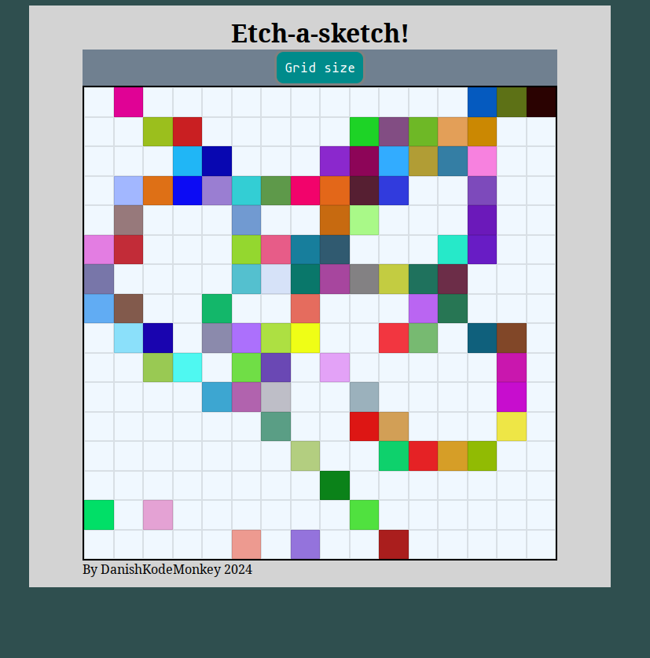
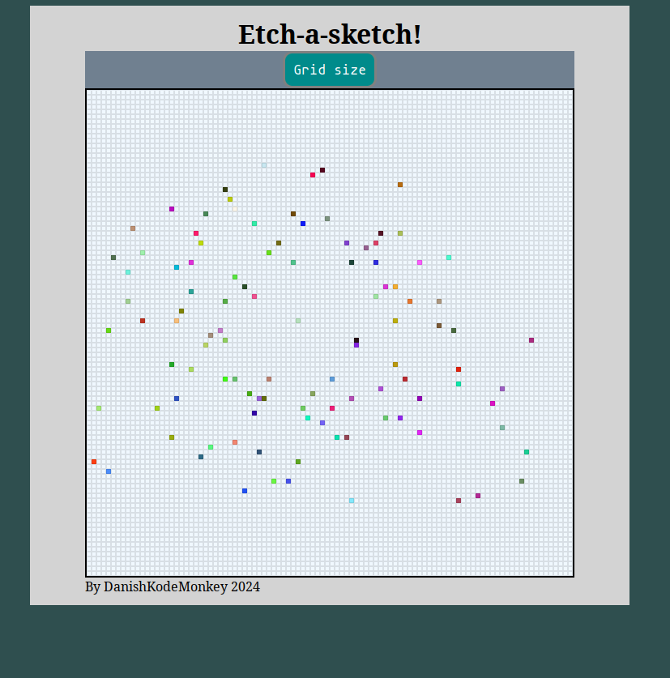

# Etch-a-sketch

## An exercise in DOM manipulation

## Description

This project is an exercise is DOM manipulation, using everything I've learned up until this point from [The Odin Project](https://www.theodinproject.com/lessons/foundations-etch-a-sketch)

The result of this exercise should be something between a sketchpad, and an etch-a-sketch

> **_What is etch-a-sketch?_**  Etch a sketch is a mechanical drawing toy where the user uses two knobs to draw a single continous line that can sketch out various pieces of artwork.[[1]](https://en.wikipedia.org/wiki/Etch_A_Sketch)

## The assignment

During the exercise, I am given some basic directions to outline the end-product of the exercise, coming up with how to reach the solution however, is all on me.

#### The directions are as follows:

<ol>
<li>Create a 16x16 grid of square divs
    <ul>
    <li>the divs in the grid may only be created using javascript DOM manipulation, no hard coding into the HTML and CSS allowed!
    <li>
    put the square divs into a div container to manage them from as a whole
    </li>
    <li>
    use flexbox to make divs form a grid. Make sure NOT to use css grid for this.
    </ul>
<li>Set up a "hover" effect so the grid changes color when the mouse passes over them, leaving a "pixelated" trail through the grind, like a pen would.</li>
<li>Add a button to the top of the screen that will send a popup for the user, asking for the number of squares per side for the new grid.
    <ul>
    <li>once submitted, the existing grid should be removed, and replaced with the new grid, generating in the same total space as before (e.g. 960px wide) so a new sketch pad is formed.</li>
    <li> Account for the performance impact of the larger grid sizes, by limiting the users input to a maximum of 100.
    </ul>
<li>Extra credit: Randomise the colors on the grid!</li>
</ol>

## The solution

Below are some images of the finished product in action:

> ### default 16x16 grid

> ### A 100x100 grid!
>
> 

## How does it work?

Etch-a-sketch was a practice of what I've learned up until now, so it ended up involving the use of some neat DOM manipulation techniques, event listeners, and CSS flexbox magic!

The main work horse of this is a function called makeGrid that is in charge of establishing a grid of div boxes depending on the users input, or by default, a size of 16x16

Using event listeners to detect when the mouse moves over the appended divs, a script is called that changes the background color of that div to a randomised rgb value.

This keeps going until the user decides to either refresh the page, or click the "grid size" button.
This will create a prompt that asks the user for a desired size, within a certain range.
Once a valid range is input, the grid is cleared, and a new one is formed shortly after.

## Try it out!

Best way to see it is to try it out!

### Check it [here](https://danishkodemonkey.github.io/etch-a-sketch/)

## Final words

Despite having gone through several exercises and practices already, I learned alot about the process of problem solving, researching possible solutions, and the persistance of trying different approaches when something doesn't work out. It was a fascinating and enjoyable trip overall. And the result turned out great!
